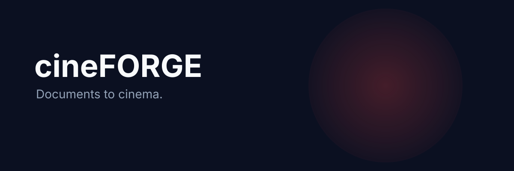

# cineFORGE

<p align="center">
  
</p>

<p align="center">
  
</p>

<h3 align="center">Documents to cinema.</h3>

<p align="center">Turn source documents and outlines into cinematic videos with full creative control.</p>

<p align="center">
  <a href="https://lumenhelixlab.github.io/cineFORGE/">Launch Page</a>
  <span> · </span>
  <a href="https://github.com/lumenhelixlab/cineFORGE">GitHub</a>
  <span> · </span>
  <a href="https://lumenhelix.com">LumenHelix</a>
</p>

---

cineFORGE is a local-first desktop application that turns source documents and outlines into coherent 30-second to 10-minute cinematic videos. It orchestrates an LLM director, multi-provider video adapters, and FFmpeg-based stitching so you control every seam: storyboard, style pack, per-shot prompt, transition, narration, and final cut.

## Why cineFORGE

- **Own the pipeline.** From ingestion to final cut, every seam is editable and reversible.
- **Switch providers.** Use cloud quality, local privacy, or hybrid previews without rewriting workflows.
- **Stay local.** Projects live in SQLite + flat files — no required cloud, no lock-in.

## Quick start

### macOS / Linux

```bash
git clone https://github.com/lumenhelixlab/cineFORGE.git
cd cineFORGE
python3.12 -m venv .venv
.venv/bin/pip install --upgrade pip
.venv/bin/pip install -e ".[vertex,fal,dev]"
cd ui && npm install
cd .. && cargo tauri dev
```

### Windows (PowerShell)

```powershell
git clone https://github.com/lumenhelixlab/cineFORGE.git
Set-Location cineFORGE
python -m venv .venv
.venv\Scripts\pip install --upgrade pip
.venv\Scripts\pip install -e ".[vertex,fal,dev]"
cd ui
npm install
cd ..
cargo tauri dev
```

### Windows (Git Bash / WSL)

```bash
git clone https://github.com/lumenhelixlab/cineFORGE.git
cd cineFORGE
python3.12 -m venv .venv
.venv/bin/pip install --upgrade pip
.venv/bin/pip install -e ".[vertex,fal,dev]"
cd ui && npm install
cd .. && cargo tauri dev
```

> Tested on Windows 11, macOS Sonoma, Ubuntu 22.04/24.04, and modern mobile browsers.

## Features

| Feature | What it gives you |
|---------|-------------------|
| LLM Director | Auto-generate treatments, storyboards, per-shot prompts, and continuity bibles from any source document. |
| Multi-provider video | Route to Vertex Veo, fal.ai, Wan2GP, ComfyUI, Kling, Sora, and more from one capability-aware pipeline. |
| Local-first desktop | Tauri 2 shell + SolidJS UI + FastAPI backend keeps projects, media, and decisions on your machine. |
| Deterministic editing | MoviePy + FFmpeg stitching with routing profiles, transitions, narration, and versioned project bundles. |

## Architecture

```
cineFORGE/
├── backend/     Python 3.12 + FastAPI — adapters, director, stitcher
├── ui/          SolidJS + Tailwind — project editor and timeline
└── src-tauri/   Tauri 2.x (Rust) — desktop shell and system bridge
```

## Development

```bash
# Backend only
.venv/bin/uvicorn backend.app:app --host 127.0.0.1 --port 8765 --reload
# Frontend only
cd ui && npm run dev
# Full Tauri desktop app
cargo tauri dev
```

## Roadmap

- [ ] ComfyUI node-editor integration for custom local workflows
- [ ] B-roll bulk generation via the MoneyPrinterTurbo bridge
- [ ] One-click export to MP4, ProRes, and versioned project bundles

## License

Released under the MIT License. Style packs and shot grammars are CC-BY-4.0.

---

<p align="center">
  <sub>cineFORGE is a <a href="https://lumenhelix.com">LumenHelix</a> project — Applied Symbolic Dynamics & Reversible Computation.</sub>
</p>
